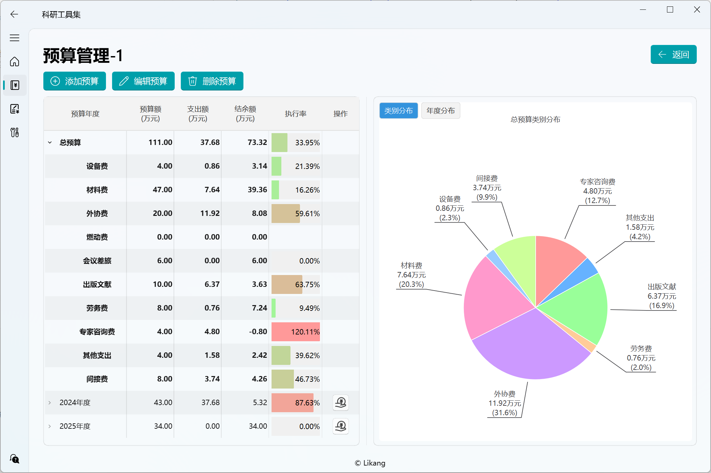

<p align="center">
  
</p>
  <h1 align="center">
  科研工具集 - ResearchToolset
</h1>
<p align="center">
  基于 PySide6 和 QFluentWidgets 的跨平台科研经费管理工具软件
</p>



## 项目简介

目前软件的功能主要为科研经费管理，旨在帮助科研人员高效管理和追踪项目资金使用情况。

后续将不断丰富功能模块，目标是形成一个功能多样的工具集。

项目基于本人日常科研工作需要，利用VSCode+Cline+DeepSeek进行开发，项目代码还比较混乱，可能有很多无用或重复代码以及未知bug，未必适用于所有科研工作者，请谨慎使用。

## 主要功能

- **经费追踪**
用于项目实施阶段的经费执行情况追踪的工具

  - **项目管理**
    - 添加、编辑、删除项目信息
    - 支持多种项目类别（国家自然科学基金、国家重点研发计划等）
    - 项目基本信息维护（项目编号、起止时间、总经费等）

  - **预算管理**
    - 总预算管理
    - 添加、编辑、删除年度预算信息
    - 直观显示总预算及年度预算的预算额、支出额、结余额、执行率
    - 总预算及年度预算执行情况统计，按类别、时间分布统计饼图  

  - **支出管理**
    - 添加、编辑、删除支出记录
    - 支持批量导入支出信息
    - 支持导入支出凭证
    - 支出记录排序、筛选、导出    
    
- **预算编制**
  - 用于课题申请阶段的预算编制工具，功能开发中

- **小工具**
  - 间接经费计算器


- **更多功能待添加……**

## 计划

- ✅ 基于qfluentwidgets重构UI（持续优化中）
- ✅ 支出信息批量导入
- ✅ 支出信息列表排序、筛选、导出
- ✅ 支出凭证插入、导出
- ✅ 预算管理列表执行率进度条
- ✅ 预算管理界面统计图表
  - ✅ 按列表支出分布
  - ✅ 按时间支出分布
- ✅ 预算编制功能模块 (待完善...)
- ❌ 预算编制数据导出 (明细、汇总、分年度...)
- ❌ 丰富主页功能 (项目执行率、统计图卡片...)


## 系统要求
- Python 3.6+
- Windows 操作系统

## 界面展示

## 下载安装
前往 Releases 下载后解压双击 ResearchToolset.exe 打开图形界面

## 源码运行
1. 克隆项目到本地：
```bash
git clone https://github.com/Likang1988/ResearchToolset.git
cd ResearchToolset
```

2. 安装依赖包：
```bash
pip install -r requirements.txt
```

## 使用说明
1. 运行程序：
```bash
python run.py
```

2. 基本操作流程：
   - 添加新项目：点击"添加项目"按钮，填写项目信息
   - 管理项目经费：在项目列表中点击"预算管理"按钮
   - 编辑总预算：选中总预算条目，点击"编辑预算"按钮
   - 添加年度预算：点击"添加预算"按钮，填写年度预算信息
   - 管理年度支出：在预算列表中点击"支出管理"按钮
   - 添加支出记录：点击"添加支出"按钮，填写支出信息
   - 批量导入支出：在添加支出对话框可使用"批量导入"功能
   - 支出凭证管理：在支出列表中点击"凭证管理"按钮
   - 导出支出信息：按类别、金额、时间筛选，点击"导出"按钮，选择导出格式

## 依赖项
- PySide6 >= 6.5.0
- PySide6-Fluent-Widgets >= 1.7.4
- pandas >= 2.0.0
- matplotlib >= 3.7.0
- openpyxl >= 3.1.0
- python-dateutil >= 2.8.2
- SQLAlchemy >= 2.0.0

## 注意事项
- 建议定期备份数据库文件
- 批量导入数据时请使用系统提供的模板

## 版本历史
- v0.1.0: 初始版本，实现基本功能，界面简陋
- ......
- v0.8.0: 完成界面重构


## 贡献
欢迎贡献代码和建议。请在 GitHub 上 fork 项目，提交 pull request。

## 联系
如有问题或建议，请通过 GitHub 提交Issues或邮件联系我 likang1225@live.com。

## 致谢
- [zhiyiYo/PyQt-Fluent-Widgets](https://qfluentwidgets.com/zh/)：强大、可扩展、美观优雅的 Fluent Design 风格组件库。新版 UI 重构基于QFluentWidgets。

## 许可证
ResearchToolset使用 GPLv3 许可证进行授权。

版权所有 © 2025 by Likang1988.